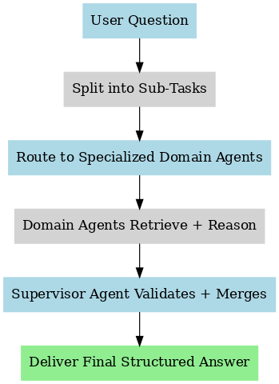

# Local Agentic Reasoning System (LARS)

> **Project Pitch:**  
> I built a local-first, agentic RAG system that processes complex user queries by reasoning, researching, and validating across multiple specialized agents.  
> Instead of simple retrieval, the system splits questions into sub-tasks, routes each sub-question to a domain expert, verifies the outputs with a Supervisor Agent, and synthesizes a complete, high-quality final answer.

---

## System Diagram

---

## What It Does
- Receives complex natural language questions
- Breaks down questions into sub-tasks using smart parsing
- Routes each sub-task to specialized domain agents
- Each agent retrieves and reasons about its specific topic
- A Supervisor Agent validates, merges, and finalizes the structured answer
- All data processing happens **locally** to protect privacy and improve speed

---

## Technologies Used
- n8n (workflow orchestration)
- Local LLM connections (Ollama / Custom LLM base URLs)
- Local vector search (PGVector, PostgreSQL)
- Metadata-based agent routing
- Multi-agent reasoning flow design
- RAG (Retrieval-Augmented Generation) strategies with local knowledge bases

---

## Files
- **local_agentic_rag_system_customized.json** — The customized n8n workflow
- **local-agentic-rag-system-diagram.png** — Visual system flow diagram

---

## Why This Matters
LARS demonstrates how AI systems can move beyond simple lookup responses — building **local-first**, **secure**, **multi-agent reasoning systems** that adapt to complex real-world user queries.  
This is a blueprint for real-world, scalable AI deployment in enterprises where data privacy, modularity, and flexibility are critical.

---

## Future Work

- Build an offline fallback mode if local retrieval sources are temporarily unavailable
- Integrate domain-specific fine-tuned local LLMs for highly technical queries
- Develop self-evaluation mechanisms where agents validate their own sub-task outputs before Supervisor aggregation
- Add usage logging and anonymized reporting for continuous system tuning without violating user privacy

---
*Demo built for AI Agent Implementation Manager portfolio presentation.*
